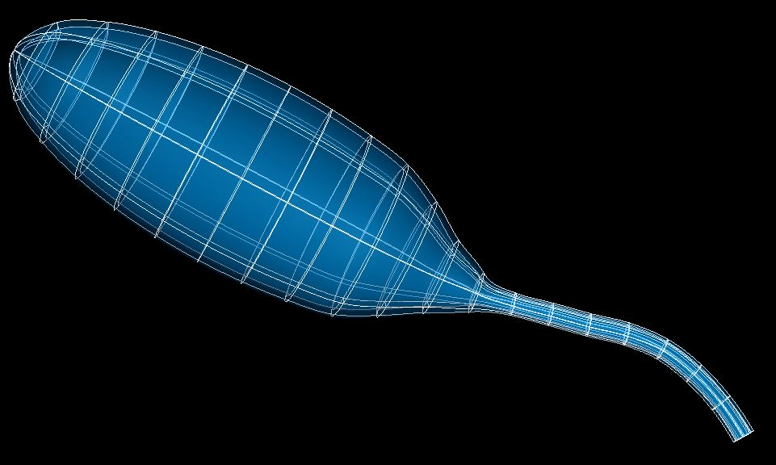

Bladder Scaffold
================

The current bladder scaffold is ``3D bladder with Urethra 1`` built from ``class MeshType_3d_bladderurethra1``.
The cat variant is shown in :numref:`fig-scaffoldmaker-cat-bladder`.

.. _fig-scaffoldmaker-cat-bladder:

   Cat bladder scaffold.

As with the other organ systems, the lower urinary tract (LUT) contains different sub-scaffolds consisting of the bladder, its ureters, and the urethra.

The bladder scaffold is a 3-D volumetric model, designed topologically as a hollow organ defined by a central line which follows the path of a bladder traced from an image.

The current scaffold consists of different parts to represent the bladder body, bladder neck, ureters opening on the bladder, and the urethra. The neck of the bladder is represented in the scaffold as a narrowing of the body at the region where ureters penetrate the surface into the lumen of the bladder.

.. note::

   A separate bladder-only scaffold is in development.

Variants
--------

The bladder scaffold is provided with parameter sets for the following five species, which differ subtly in shape and location of ureter inlets:

* Cat
* Human
* Mouse
* Pig
* Rat

These variants' geometry and annotations are best viewed in the **Scaffold Creator** tool in the ABI Mapping Tools. On the web, the latest published generic bladder scaffold variants can be viewed on the `SPARC Portal <https://sparc.science/>`_ by searching for ``bladder``, filtering for models, selecting a variant and viewing the scaffold in its Gallery tab.

The bladder scaffold script generates the scaffold mesh and geometry based on some parameters include the diameters for different axes, wall thickness, neck angle (for bladder only), etc., which are all defined for the bladder and urethra separately. The ability to control these parameters, as well as variations of them throughout the length of the bladder and urethra allows the scaffold to be configurable for different species and individuals.

The urethra is optional and can be turned on with the *Include urethra* setting. By default the ureter inlets are marker points on the inner (luminal) surface, but by checking the *Include ureters* option these can be made as 3D element structures.

Importantly, the entire scaffold is generated based on a configurable central path defined from apex to urethra, which facilitates the initialization of the shape as well as annotation. The scaffold can now be used to register and map various data including neurons, or to define time-varying fields such as pressure or volume measured experimentally.

Instructions for editing the central path are given with the ABI Mapping Tools **Scaffold Creator** documentation.

Coordinates
-----------

The bladder scaffold defines the geometric and flat coordinates.

The geometric ``coordinates`` field gives an approximate, idealized representation of the bladder shape for the species, which is intended to be fitted to actual data for a specimen.

The ``flat coordinates`` represents the geometric field when the bladder scaffold is cut along its length and laid flat. This field is intended for fitting data obtained from a flat bladder preparation.

A material coordinates field is not provided, so to perform embedding at this time, it is necessary to use the generic ``coordinates`` field as material coordinates. This omission will be fixed in the future bladder-only scaffold.

The bladder scaffold supports limited refinement/resampling by checking *Refine* (set parameter to ``true``) with chosen *Refine number of elements~* parameters. Be aware that only the ``coordinates`` field is currently defined on the refined mesh (but annotations are transferred).

Annotations
-----------

Important anatomical regions of the bladder are defined by groups of elements (or faces, edges and nodes/points) and annotated with standard term names and identifiers from a controlled vocabulary.

Annotated 3-dimensional volume regions are defined by groups of 3-D elements including (using only one of the items separated by slash /):

* dome of the bladder
* neck of urinary bladder
* urinary bladder
* urethra
* dorsal/ventral part of bladder/urethra

**Terms for volume regions such as the above are not to be used for digitized contours!** They are used for applying different material properties in models and the strain/curvature penalty (stiffness) parameters in fitting.

Annotated 2-dimensional surface regions are defined for matching annotated contours digitized from medical images including (using only one of the items separated by slash /):

* bladder lumen
* dorsal/ventral part of lumen/serosa of body/neck of urinary bladder
* dorsal/ventral part of lumen/serosa of urethra
* dorsal/ventral part of serosa of urinary bladder
* dorsal/ventral part of urinary bladder lumen
* lumen/serosa of body/neck of urinary bladder
* lumen/serosa of urethra
* serosa of urinary bladder

The bladder scaffold currently has no annotated 1-dimensional line regions.

Several fiducial marker points are defined on the bladder scaffold, of which the following five are potentially usable when digitizing:

* apex of urinary bladder
* left/right ureter junction with bladder
* urethra junction of dorsal/ventral bladder neck

At present these are all defined on the inner surface of the bladder.