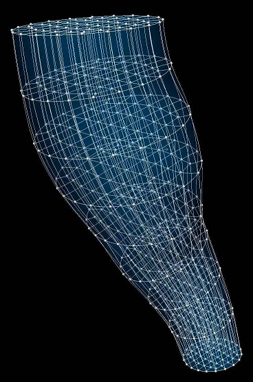

Brainstem Scaffold
==================

The current brainstem scaffold is ``3D brainstem 1`` built from ``class MeshType_3d_brainstem1``.
The human variant is shown in :numref:`fig-scaffoldmaker-human-brainstem`.

.. _fig-scaffoldmaker-human-brainstem:

   Human brainstem scaffold.

The brainstem scaffold is a 3-D volumetric model of the brainstem representing all three parts: midbrain, pons, and
medulla oblongata. Each part is meshed with its own elements but these are connected with common faces to the elements
of the neighbouring parts.

Variants
--------

The brainstem scaffold is provided with parameter sets for the following six species, which differ in shape and size.

* Cat
* Human
* Mouse
* Pig
* Rat
* Sheep

These variants' geometry and annotations are best viewed in the **Scaffold Creator** tool in the ABI Mapping Tools.
On the web, the latest published generic brainstem scaffold variants can be viewed on the
`SPARC Portal <https://sparc.science/>`_ by searching for ``brainstem``, filtering for models, selecting a variant and
viewing the scaffold in its Gallery tab.

The brainstem scaffold script generates the scaffold mesh and geometry from a solid cylinder function based on a
one dimensional central path with side axes controlling lateral dimensions. The parameters were carefully tuned for
each species, and it is not recommended that these be edited.

Instructions for editing the central path are given with the ABI Mapping Tools **Scaffold Creator** documentation.
Note that the D2 and D3 derivatives control the side dimensions, and derivatives D12 and D13 control the rate of change
of these along the central path. If editing, use the Interactive Functions to *Smooth derivatives*,
*Make side derivatives normal* and *Smooth side cross derivatives* to make these as smooth as required.

.. note::

   The central path is annotated with ``midbrain``, ``pons``, and ``medulla oblongata`` regions but these are only
   approximately used to define their geometric extents in the final scaffold. Be aware that material coordinates are
   only correctly defined when there are exactly 8 elements along the brainstem. These limitations will be fixed at a
   later date.

Coordinates
-----------

The brainstem scaffold defines both geometric and material coordinates.

The geometric ``coordinates`` field gives an approximate, idealized representation of the brainstem shape for the
species, which is intended to be fitted to actual data for a specimen.

The material coordinates field ``brainstem coordinates`` defines a highly idealized coordinate system to give
permanent locations for embedding structures in the brainstem. This is a cylinder of unit radius and 8 units long:
intended to be 3 units for medulla oblongata, 3 units for pons, and 2 units for midbrain. Be aware at this time that
these ratios are only correctly defined if there are 8 elements along the brainstem.

The brainstem scaffold supports limited refinement/resampling by checking *Refine* (set parameter to ``true``) with
chosen *Refine number of elements~* parameters. Be aware that only the ``coordinates`` field is currently defined
on the refined mesh (but annotations are transferred).

Annotations
-----------

Important anatomical regions of the brainstem are defined by groups of elements (or faces, edges and nodes/points) and
annotated with standard term names and identifiers from a controlled vocabulary.

Annotated 3-dimensional volume regions are defined by groups of 3-D elements:

* brainstem
* medulla oblongata
* midbrain
* pons

**Terms for volume regions such as the above are not to be used for digitized contours!** They are used for applying
different material properties in models and the strain/curvature penalty (stiffness) parameters in fitting.

Annotated 2-dimensional surface regions are defined for matching annotated contours digitized from medical images
including (where ``interface`` means the outside boundary of the brainstem connecting to different organs such as
thalamus and spinal cord, ``exterior`` is the outside boundary of the brainstem not including interfaces to structures
along its length):

* brainstem exterior
* brainstem-spinal cord interface
* medulla oblongata exterior
* midbrain exterior
* pons exterior
* thalamus-brainstem interface

Annotated 1-dimensional line regions are defined on the central path and used to label elements in each part (but be
aware of their limitations noted above):

* medulla oblongata
* midbrain
* pons

Several fiducial marker points are defined on the brainstem scaffold, of which the following eight are potentially
usable when digitizing:

* brainstem dorsal midline caudal point
* brainstem ventral midline caudal point
* brainstem dorsal midline pons-medulla junction
* brainstem ventral midline pons-medulla junction
* brainstem dorsal midline midbrain-pons junction
* brainstem ventral midline midbrain-pons junction
* brainstem dorsal midline cranial point
* brainstem ventral midline cranial point

