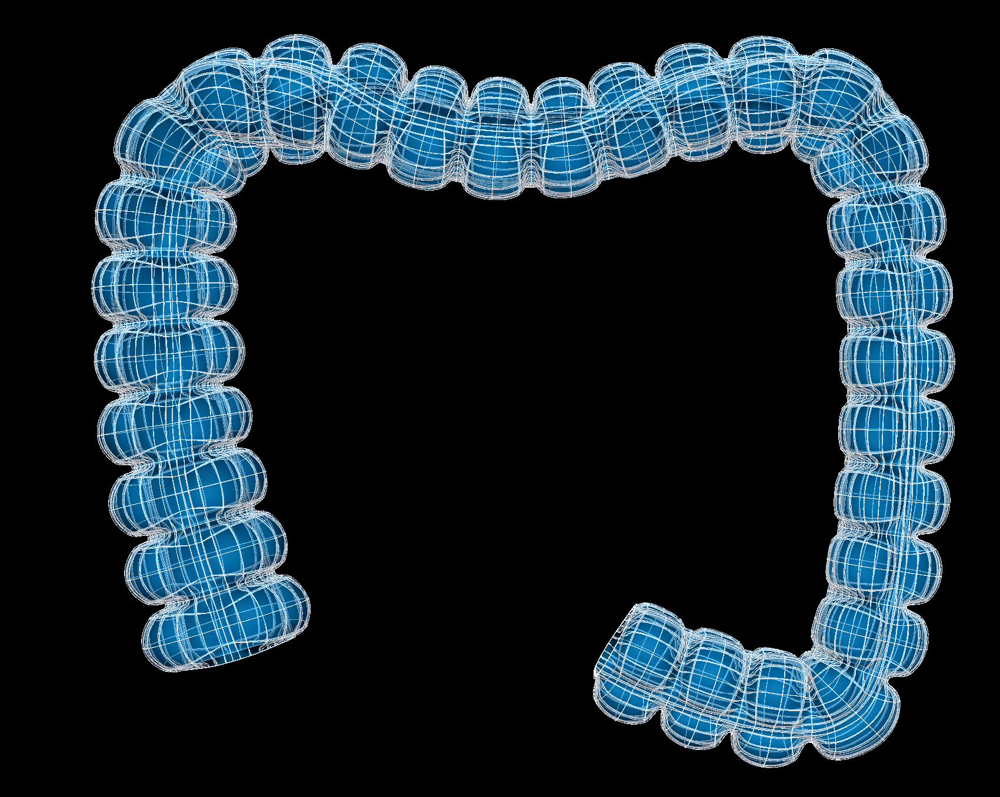

Colon Scaffold
=============

The current colon scaffold is ``3D Colon 1`` built from ``class MeshType_3d_colon1``.
The human variant is shown in :numref:`fig-scaffoldmaker-human-colon`.

.. _fig-scaffoldmaker-human-colon:

   Human colon scaffold.

The colon scaffold is a 3-D volumetric model of the colon representing the proximal, transverse and distal colon.

Variants
--------

The colon scaffold is provided with parameter sets for the following four species, which differ in shape, and in
particular have different numbers of tenia coli:

* Cattle (no tenia coli)
* Human (3 tenia coli)
* Mouse (no tenia coli)
* Pig (2 tenia coli)

These variants' geometry and annotations are best viewed in the **Scaffold Creator** tool in the ABI Mapping Tools.
On the web, the latest published generic colon scaffold variants can be viewed on the
`SPARC Portal <https://sparc.science/>`_ by searching for ``colon``, filtering for models, selecting a variant and
viewing the scaffold in its Gallery tab.

The colon scaffold script generates the scaffold mesh and geometry from an idealization of their cross-sectional profile
shapes. The mesh is derived from ellipsoid and cubic functions based on a one dimensional central path which describes
the path of the colon. The parameters were carefully tuned for each species, and it is not recommended that these be
edited.

Instructions for editing the central path are given with the ABI Mapping Tools **Scaffold Creator** documentation.
Note that the D2 derivative along the path points towards the first node around the cross-section along the colon.
If editing, use the Interactive Functions to *Smooth derivatives*, and *Smooth side cross derivatives* to make these as
smooth as required.

The mucosa, submucosa, circular muscle, longitudinal muscle and serosa layers of the colon are fully represented on
the scaffold when *Number of elements through wall* is set to ``4``. Alternatively, the entire colon wall can be
represented as a single layer by setting *Number of elements through wall* to ``1``.

Coordinates
-----------

The colon scaffold defines the geometric, flat and material coordinates.

The geometric ``coordinates`` field gives an approximate, idealized representation of the colon shape for the species,
which is intended to be fitted to actual data for a specimen.

The ``flat coordinates`` represents the geometric field when the colon scaffold is cut along its length and laid flat.
This field is intended for fitting data obtained from a flat colon preparation.

The material coordinates field ``colon coordinates`` defines a highly idealized coordinate system to give permanent
locations for embedding structures in the colon. It is a cylindrical tube and can be viewed by visualising this field in
the *Display* tab of **Scaffold Creator**.

The colon scaffold supports limited refinement/resampling by checking *Refine* (set parameter to ``true``) with chosen
*Refine number of elements* parameter. Be aware that only the ``coordinates`` field is currently defined on the refined
mesh (but annotations are transferred).

Annotations
-----------

Important anatomical regions of the colon are defined by groups of elements (or faces, edges and nodes/points) and
annotated with standard term names and identifiers from a controlled vocabulary.

Annotated 3-dimensional volume regions are defined by groups of 3-D elements including:

* ascending colon (only in human)
* circular muscle layer of colon
* colon
* colonic mucosa
* descending colon (only in human)
* distal colon (in cattle, mouse, pig)
* longitudinal muscle layer of colon
* proximal colon (in cattle, mouse)
* spiral colon (only in pig)
* submucosa of colon
* tenia coli (in human, pig)
* tenia libera (only in human)
* tenia mesocolica (only in human)
* tenia omentalis (only in human)
* transverse colon

**Terms for volume regions such as the above are not to be used for digitized contours!** They are used for applying
different material properties in models and the strain/curvature penalty (stiffness) parameters in fitting.

Annotated 2-dimensional surface regions are defined for matching annotated contours digitized from medical images
including (where ``surface`` is the outside boundary on the meshes):

* luminal surface of the colonic mucosa
* serosa of colon
