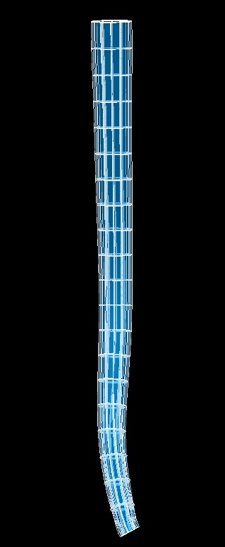

Esophagus Scaffold
==================

The current esophagus scaffold is ``3D Esophagus 1`` built from ``class MeshType_3d_esophagus1``.
The human variant is shown in :numref:`fig-scaffoldmaker-human-esophagus`.

.. _fig-scaffoldmaker-human-esophagus:

   Human esophagus scaffold.

The esophagus scaffold is a 3-D volumetric model of the esophagus representing the cervical, thoracic and abdominal
esophagus.

Variants
--------

The esophagus scaffold is provided with parameter set only for human at this stage.

This variant's geometry and annotations are best viewed in the **Scaffold Creator** tool in the ABI Mapping Tools.
On the web, the latest published generic esophagus scaffold variant can be viewed on the
`SPARC Portal <https://sparc.science/>`_ by searching for ``esophagus``, filtering for anatomical models, selecting a
variant and viewing the scaffold in its Gallery tab or via the `Organ Scaffolds
<https://docs.sparc.science/docs/organ-scaffolds>`_ help article.

The esophagus scaffold script generates the scaffold mesh and geometry from ellipsoid and cubic functions based on a one
dimensional central path which describes the path of the esophagus. The parameters were carefully tuned for the species,
and it is not recommended that these be edited.

Instructions for editing the central path are given with the ABI Mapping Tools **Scaffold Creator** documentation.
Note that the D2 derivative along the path points towards the first node around the cross-section along the esophagus.
If editing, use the Interactive Functions to *Smooth derivatives*, and *Smooth side cross derivatives* to make these as
smooth as required.

The central path used to generate the current human esophagus scaffold is obtained from tracing a central path from
esophageal data retrieved from Anatomography.

The mucosa, submucosa, circular muscle, longitudinal muscle and serosa layers of the esophagus are fully represented on
the scaffold when *Number of elements through wall* is set to ``4``. Alternatively, the entire esophagus wall can be
represented as a single layer by setting *Number of elements through wall* to ``1``.

Coordinates
-----------

The esophagus scaffold defines the geometric, flat and material coordinates.

The geometric ``coordinates`` field gives an approximate, idealized representation of the esophagus shape for the
species, which is intended to be fitted to actual data for a specimen.

The ``flat coordinates`` represents the geometric field when the esophagus scaffold is cut along its length and laid
flat. This field is intended for fitting data obtained from a flat esophagus preparation.

The material coordinates field ``esophagus coordinates`` defines a highly idealized coordinate system to give permanent
locations for embedding structures in the esophagus. It is a cylindrical tube and can be viewed by visualising this
field in the *Display* tab of **Scaffold Creator**.

The esophagus scaffold supports limited refinement/resampling by checking *Refine* (set parameter to ``true``) with
chosen *Refine number of elements* parameters. Be aware that only the ``coordinates`` field is currently defined on the
refined mesh (but annotations are transferred).

Annotations
-----------

Important anatomical regions of the esophagus are defined by groups of elements (or faces, edges and nodes/points) and
annotated with standard term names and identifiers from a controlled vocabulary.

Annotated 3-dimensional volume regions are defined by groups of 3-D elements including:

* abdominal part of esophagus
* cervical part of esophagus
* esophagus
* esophagus mucosa
* esophagus smooth circular layer
* esophagus smooth longitudinal layer
* submucosa of esophagus
* thoracic part of esophagus

**Terms for volume regions such as the above are not to be used for digitized contours!** They are used for applying
different material properties in models and the strain/curvature penalty (stiffness) parameters in fitting.

Annotated 2-dimensional surface regions are defined for matching annotated contours digitized from medical images
including (where ``surface`` is the outside boundary on the meshes):

* luminal surface of esophagus
* serosa of esophagus

Annotated 1-dimensional line regions are defined for matching annotated contours digitized from medical images including
(using only one of the items separated by slash /):

* circular-longitudinal muscle interface of esophagus along the cut margin

Several fiducial marker points are defined on the esophagus scaffold, of which the followings are potentially usable
when digitizing:

* distal point of lower esophageal sphincter serosa on the greater/lesser curvature of stomach
* proximodorsal/ proximoventral midpoint on serosa of upper esophageal sphincter