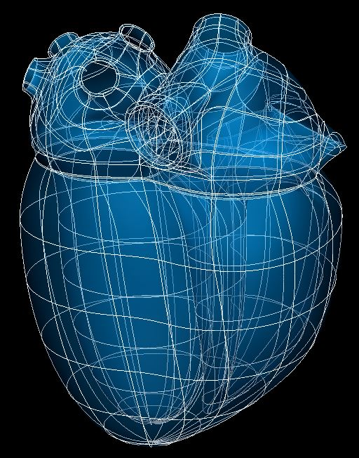

Heart Scaffold
==============

The current recommended heart scaffold is ``3D Heart 1`` built from ``class MeshType_3d_heart1``; the human variant is shown in :numref:`fig-scaffoldmaker-human-heart`.

.. _fig-scaffoldmaker-human-heart:

   Human heart scaffold.

The heart scaffold is a 3-D volumetric model of the heart representing solid walls of all four chambers. It has pulmonary vein and vena cava inlets, simple representations of auricles (atrial appendages), but does not have representations of the heart valves (only their orifices, or boundaries with the ventricles). Only the myocardium layer is fully represented (but see below).

.. note::

   Separate scaffolds are provided for the heart ventricles (below base/valve plane), ventricles with base, and atria. Beware that the heart atria scaffold is not compatible with the full heart scaffold because it uses different numbering for elements, faces and nodes; if working on a subset of the heart it is recommended to create the whole heart scaffold and delete the unwanted elements, which allows the resulting subset to be merged with the whole heart. Further to this, all scaffolds used must be built with the same parameters for numbers of elements, inlets, optional layers etc. to be able to merge together.

Variants
--------

The heart scaffold is provided with parameter sets for the following four species, which differ in shape, and in particular have different numbers of pulmonary veins:

* Human (2 left, 2 right pulmonary veins)
* Pig (1 left, 1 right pulmonary veins)
* Rat (3 pulmonary veins: left, middle, right)
* Mouse (3 pulmonary veins: left, middle, right)

These variants' geometry and annotations are best viewed in the **Scaffold Creator** tool in the ABI Mapping Tools. On the web, the latest published generic heart scaffold variants can be viewed on the `SPARC Portal <https://sparc.science/>`_ by searching for ``heart``, filtering for models, selecting a variant and viewing the scaffold in its Gallery tab. 

The heart scaffold script generates the scaffold mesh and geometry from ellipsoid and cubic functions with many parameters controlling the shape. The parameters were carefully tuned for each species, and it is not recommended that these be edited.

An advanced optional feature is to check *Define epicardium layer* (set parameter to ``true``) which adds a layer of 3-D elements outside the myocardium to represent the thick epicardium layer consisting of epicardial fat and other tissue. This is currently only implemented over the atria, excluding the auricles.

Coordinates
-----------

The heart scaffold only defines geometric coordinates (field ``coordinates``) which give geometry at approximately unit scale. Note that the scaffold has a *Unit scale* parameter (default value ``1.0``) which scales the entire scaffold efficiently.

A material coordinates field is not provided, so to perform embedding at this time, it is necessary to use the generic ``coordinates`` field as material coordinates, built with the standard, *unmodified* parameter set (incl. *Unit scale* ``1.0``) for the species.

The heart scaffold supports limited refinement/resampling by checking *Refine* (set parameter to ``true``) with chosen *Refine number of elements~* parameters. Be aware that only the ``coordinates`` field is currently defined on the refined mesh (but annotations are transferred), and the refined whole heart is only conformant if all *Refine number of elements~* parameters have the same value.

Annotations
-----------

Important anatomical regions of the heart are defined by groups of elements (or faces, edges and nodes/points) and annotated with standard term names and identifiers from a controlled vocabulary.

Annotated 3-dimensional volume regions are defined by groups of 3-D elements including (using only one of the items separated by slash /):

* left/right atrium/ventricle myocardium
* left/middle/right pulmonary vein
* inferior/superior vena cava
* left/right auricle

**Terms for volume regions such as the above are not to be used for digitized contours!** They are used for applying different material properties in models and the strain/curvature penalty (stiffness) parameters in fitting.

Annotated 2-dimensional surface regions are defined for matching annotated contours digitized from medical images including (where ``luminal`` means bordering the lumen or cavity of a tubular structure, ``outer`` is the outside boundary of a layer on the wall relative to the cavity):

* luminal surface of left/right atrium/ventricle
* luminal surface of left/middle/right pulmonary vein
* luminal surface of inferior/superior vena cava
* outer surface of myocardium
* outer surface of myocardium of left/right atrium/ventricle (if need to distinguish)
* outer surface of epicardium (only if *Define epicardium layer* is checked)

The following are proposed for future heart scaffolds including great vessels (the root variants being the subset of the luminal surface within the arterial valve up to the sinotubular junction) so should be used for annotating their contours:

* luminal surface of [root of] aorta
* luminal surface of [root of] pulmonary trunk

Note that luminal surfaces of atria structures are defined with an overlap in the scaffold as it is difficult to determine the exact boundary between pulmonary veins/vena cavae with the myocardium for the left/right atrium, which gives leeway for variation between digitized datasets.

Note that at organ scale additional terms such as ``endocardium of left ventricle`` which represent microscopically thin layers are defined identically to ``luminal surface of left ventricle`` etc. surface groups. However, this is not the case on the epicardium which can be a layer of finite thickness at whole organ scale.

The heart scaffold currently has no annotated 1-dimensional line regions.

Several fiducial marker points are defined on the heart scaffold, of which the following two are potentially usable when digitizing:

* apex of heart
* crux cordis

At present these are both defined on the outer surface of myocardium, but when a volumetric epicardium layer is defined over the whole heart these will either be defined on the outer surface of epicardium, or separate points defined to distinguish distinct points on the two surfaces.
