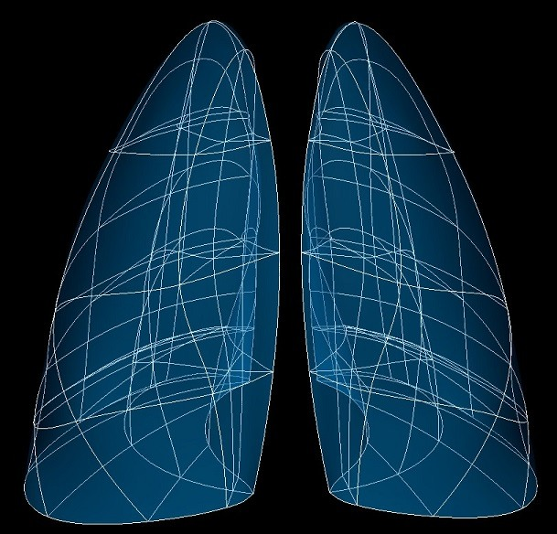

Lung 2 Scaffold
===============

The ``3D Lung 2`` Scaffold built from ``class MeshType_3d_lung2`` has variants for human, mouse, rat and pig, the non-human models having an accessory lobe.
Open fissures are optionally supported.

The human variant which is shown in :numref:`fig-scaffoldmaker-human-lung2`, but note :doc:`lung4` is now preferred for human lung studies.

.. _fig-scaffoldmaker-human-lung2:

   Human lung scaffold.

The lung scaffold is a 3-D volumetric model of the lungs representing left lung, right lung and its lobes.
Depending on the species the left lung may have lower and upper lobes, while the right lung has lower, middle and
upper lobes, and non-human right lungs usually have a 4th accessory lobe (also known as the diaphragmatic lobe).

The lung scaffold is only a representation of the volumetric spaces of the lobes and does not include representations
of the pulmonary airway, blood vessels or alveoli.

.. note::

   The lung scaffold contains two (or more) independent meshes for the left lung, right lung, and accessory lobes, and
   optionally has open fissures so the lower, middle and upper lobes of each side can be independent meshes.

Variants
--------

The lung scaffold is provided with parameter sets for the following four species, which differ in shape, and in
particular have different numbers of lobes:

* Human (2 lobes in the left, 3 lobes in the right lung)
* Mouse (1 lobe in the left, 4 lobes in the right lung)
* Pig (2 lobes in the left, 4 lobes in the right lung)
* Rat (1 lobe in the left, 4 lobes in the right lung)

These variants' geometry and annotations are best viewed in the **Scaffold Creator** tool in the ABI Mapping Tools.
On the web, the latest published generic lung scaffold variants can be viewed on the
`SPARC Portal <https://sparc.science/>`_ by searching for ``lung``, filtering for anatomical models, selecting a variant
and viewing the scaffold in its Gallery tab or via the `Organ Scaffolds
<https://docs.sparc.science/docs/organ-scaffolds>`_ help article.

The lung scaffold script generates the scaffold mesh and geometry from an idealization of their shapes. The left and
right lung (excluding accessory lobe) are generated as half ellipsoids which are then reshaped by smooth functions for
which parameters are provided on the scaffold, to give approximately realistic geometry for the species.
The accessory lobe is similarly created as a triangular prism and reshaped.

The generic lung scaffolds are parameterized and fitted to segmentation data from CT and MRI images from the following
sources: human (`Osanlouy et al. <https://doi.org/10.1038/s41598-020-73117-w>`_), mouse
(`Beichel et al. <https://lapdmouse.iibi.uiowa.edu/>`_), pig
(`Lee et al. <https://doi.org/10.1152/japplphysiol.00868.2012>`_), rat
(`NeuroRat V4.0 <https://itis.swiss/virtual-population/animal-models/animals/neurorat/neurorat-v4/>`_).

[A special ``Material`` parameter set is provided to allow new species' parameters to be developed from the material
coordinates definition (see below).]
These parameters were carefully tuned for each species, and it is not recommended that these be edited.

An advanced optional feature is to check *Open fissures* (set parameter to ``true``) which separates the lobes into
independent meshes allowing elements on opposite sides of each fissure to move independently.

Coordinates
-----------

The lung scaffold defines both geometric and material coordinates.

The geometric ``coordinates`` field gives an approximate, idealized unit-scale representation of the lung shape for the
species, which is intended to be fitted to actual data for a specimen.

The material coordinates field ``lung coordinates`` defines a highly idealized coordinate system to give
permanent locations for embedding structures in the lungs, defined as 2 half ellipsoids for the left and right lung
(excluding accessory lobe) and a triangular wedge for the accesory lobe, if present. These can be viewed by visualising
this field in the *Display* tab of **Scaffold Creator** or by switching to the special ``Material`` parameter set.

The lung scaffold supports limited refinement/resampling by checking *Refine* (set parameter to ``true``) with chosen
*Refine number of elements* parameter. Be aware that only the ``coordinates`` field is currently defined on the refined
mesh (but annotations are transferred).

Annotations
-----------

Important anatomical regions of the lungs are defined by groups of elements (or faces, edges and nodes/points) and
annotated with standard term names and identifiers from a controlled vocabulary.

Annotated 3-dimensional volume regions are defined by groups of 3-D elements including (using only one of the items
separated by slash /):

* left/right lung
* lower/middle/upper lobe of left/right lung
* lung
* right lung accessory lobe

**Terms for volume regions such as the above are not to be used for digitized contours!** They are used for applying
different material properties in models and the strain/curvature penalty (stiffness) parameters in fitting.

Annotated 2-dimensional surface regions are defined for matching annotated contours digitized from medical images
including (where ``surface`` is the outside boundary on the meshes and using only one of the items separated by slash
/):

* base of left/right lung surface
* base of lower lobe of left/right lung surface
* base of middle lobe of right lung surface
* base of upper lobe of left lung surface
* horizontal fissure of left/right lung
* horizontal fissure of lower/middle/upper lobe of left/right lung
* lateral/medial surface of left/right lung
* lateral/medial surface of lower/middle/upper lobe of left/right lung
* left/right lung surface
* lower/middle/upper lobe of left/right lung surface
* oblique fissure of left/right lung
* oblique fissure of lower/middle/upper lobe of left/right lung
* right lung accessory lobe surface
* base of right lung accessory lobe surface
* left/right/dorsal/ventral surface of right lung accessory lobe

Annotated 1-dimensional line regions are defined for matching annotated contours digitized from medical images including
(using only one of the items separated by slash /):

* anterior border of left/right lung

Several fiducial marker points are defined on the lung scaffold, of which the followings are potentially usable when
digitizing:

* apex of left/right lung
* laterodorsal tip of middle lobe of right lung
* medial/ventral base of left/right lung
* dorsal/ventral apex of right lung accessory lobe
* left/right dorsal/ventral base of right lung accessory lobe

**Digitization tips to assist fitting:**

1. A proper lung model requires accurate location of all surfaces of the lobes. This requires digitizing the fissures
and exterior surfaces of the lungs. It's not a requirement to use the most specific annotation group for a surface
(e.g. for a particular lobe instead of the whole left/right lung) but it may make fitting more efficient.

2. Digitize any fiducial markers you can identify as these are gold standard locations which can be highly weighted in
the fit.

3. The sharp anterior edges of the left/right lungs are difficult to fit. At a minimum it's important to have data
marker points for the ``ventral base of left/right lung`` fiducial markers. To properly fit the rest of the edges it's
best to have data points/contours along these edges  annotated with the 1-D ``anterior border of left/right lung``
terms, which can be weighted highly in the fit. Annotating with lateral/medial surfaces may work in some cases, but just
using lung/lobe surface groups can be problematic; in both cases there may not be enough data to definitively pull the
edge into position during the fit.

4. For fitting a lung scaffold with open fissures, annotate fissure data points/contours which clearly belong to only
one lobe with the fissure term specific to that lobe. Where fissures are too close to distinguish the lobe they are on,
annotate digitized data the generic fissure term (not for a specific lobe). Doing this allows the same data to fit all
lobes correctly.
