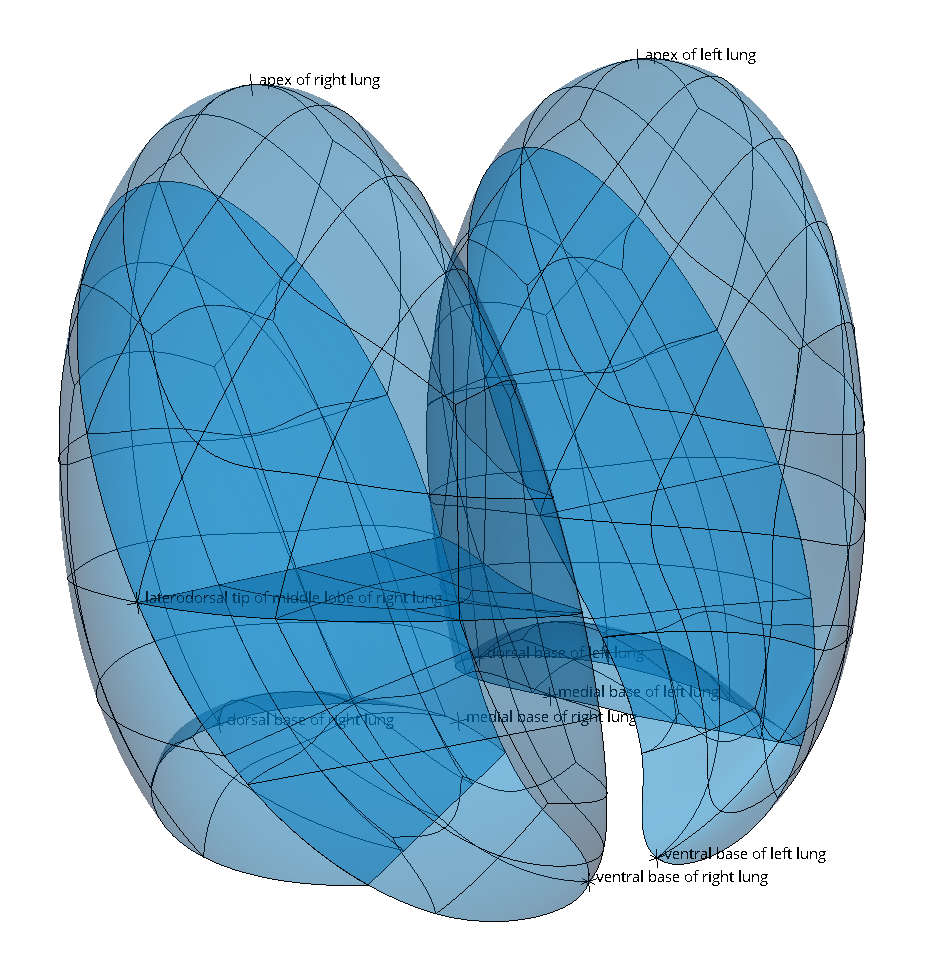
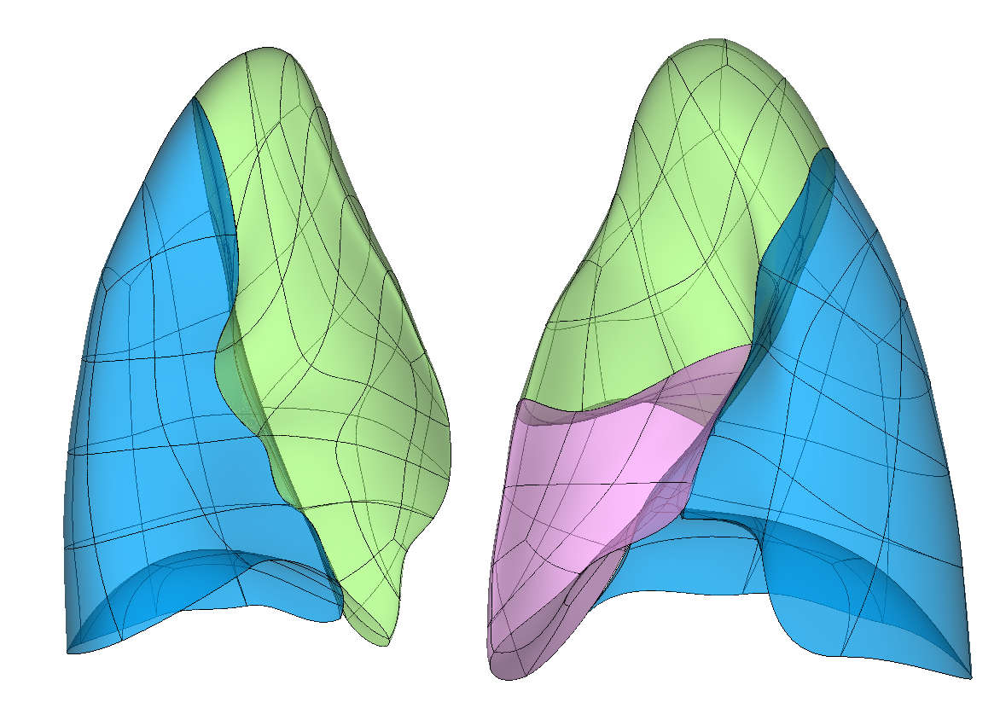

Lung 4 Scaffold
===============

The `3D Lung 4` Scaffold built from ``class MeshType_3d_lung4`` builds a volumetric model of the left and right human lungs with open fissures between lobes, but with a line of common nodes joining lobes of each lung on the hilum axis.

It is built in an idealised form on an ellipsoid and shaped slightly to give it a sharp anterior edge, concave base and slight curvature around the heart.
The scaffold mesh consists of all hexahedral (cube) elements without any collapsed faces/edges, with geometry interpolated by smooth tricubic Hermite Serendipity basis functions. The resolution / element density of the scaffold's mesh is fully controllable without changing its shape. It is suitable for fitting to a wide range of human lung shapes.

.. _fig-scaffoldmaker-lung4-human:

   3D Lung 4 Scaffold with `Human 1 Coarse` parameter set. The oblique fissures of the left and right lungs and the horizontal fissure of the right lung are shaded.

.. _fig-scaffoldmaker-lung4-fitted-left-right:

   Lung 4 Scaffold fitted to left and right human lung data. Lower lobes are blue, right middle lobe is pink and upper lobes are green.

The lung scaffold is only a representation of the volumetric spaces of the lobes and does not include representations of the pulmonary airways, blood vessels or alveoli.

Variants
--------

This scaffold currently only provides parameters for human lungs, but coarse, medium and fine mesh resolutions are provided in the idealised human shape, plus an unmodified ellipsoid.

Scaffold parameters are presented to allow other numbers of elements and shapes, but for a given population study it's expected that all fitted subjects start from the same scaffold. Lungs have quite a lot of variability in shape between subjects, so in the early stages of fitting it may be preferred to perform a gross shape change, resolve most non-linearities over 3 or more fit steps/iterations, and select `Update reference state` on the last of these iterations.

Coordinates
-----------

The lung scaffold defines only a geometric ``coordinates`` field which gives an approximate, idealized unit-scale representation of the lung shapes, which is intended to be fitted to actual data for a subject.

It is planned in future to use the coordinates generated for the ``Ellipsoid`` parameter set as common material coordinates (i.e. ``lung coordinates``) across all subjects, to use for embedding data within the lobes.

The lung scaffold supports limited refinement/resampling to trilinear elements by checking *Refine* (set parameter to ``True``) with chosen
*Refine number of elements* parameter. Be aware that only the ``coordinates`` field is currently defined on the refined
mesh (but annotations are transferred).

Annotations
-----------

Important anatomical regions of the lungs are defined by groups of elements (or faces, edges and nodes/points) and
annotated with standard term names and identifiers from a controlled vocabulary.

Annotated 3-dimensional volume regions are defined by groups of 3-D elements including (using only one of the items
separated by slash /, and noting the middle lobe is only on the right so the upper lobe of the right lung never touches the base):

* lung (everything)
* left/right lung
* lower/middle/upper lobe of left/right lung

.. note::

   Terms for volume regions such as the above are not to be used for digitized contours. They are used for applying different material properties in models and the strain/curvature penalty (stiffness) parameters in fitting.

Annotated 2-dimensional surface regions are defined for matching annotated contours digitized from medical images
including:

* base of lower/middle/upper lobe of left/right lung surface
* horizontal fissure of middle/upper lobe of right lung
* lateral/medial surface of left/right lung
* lateral/medial surface of lower/middle/upper lobe of left/right lung
* lower/middle/upper lobe of left/right lung surface
* oblique fissure of lower/middle/upper lobe of left/right lung

.. note::

   1. Horizontal and oblique fissure surfaces (and edges below) are labelled specifically for the lobe touching them. For fitting, data points on the fissures must be duplicated for each side to keep the respective surfaces together on the fissure data.
   2. The surfaces of the oblique fissure of the left-upper lobe below the hilum, and the right-middle lobe are the same as the base of the left-upper and right-middle lobes, respectively. This is to allow material to slide in or out of the fissure as there are huge variations of relative fissure and base sizes across lung populations. This is seen in :numref:`fig-scaffoldmaker-lung4-fitted-left-right` where the base of the middle lobe is very large on the right.

Annotated 1-dimensional line regions are defined for matching annotated contours digitized from medical images including:

* anterior edge of middle lobe of right lung
* antero-posterior edge of upper lobe of left/right lung
* base edge of oblique fissure of lower lobe of left/right lung
* lateral/medial edge of most surface groups listed earlier
* posterior edge of lower lobe of left/right lung

.. note::

   1. For fitting, it is a good idea to give edge data higher weights e.g. 10x default weights to pull material into some of the sharp extremeties.
   2. For fitting, edges of the fissures may need to be weighted higher to help constrain them to stay together, particularly the medial edges of the oblique fissure of the lower/upper lobe of the left lung, as the medial surface of the left lung can be quite distorted.

Several fiducial marker points are defined on the lung scaffold, as shown in :numref:`fig-scaffoldmaker-lung4-human`:

* apex of left/right lung
* dorsal/medial/ventral base of left/right lung
* laterodorsal tip of middle lobe of right lung

.. note::

   1. It is not recommended that these fiducial markers be used in the fitting process as their positions are somewhat amorphous and without them the fit will smoothly spread out elements between fissures and prescribed edges. Fitting with markers and high weights may cause severe distortions.
   2. These points are very useful for subsequent processing as they can help align fitted scaffolds for PCA and other tasks.
