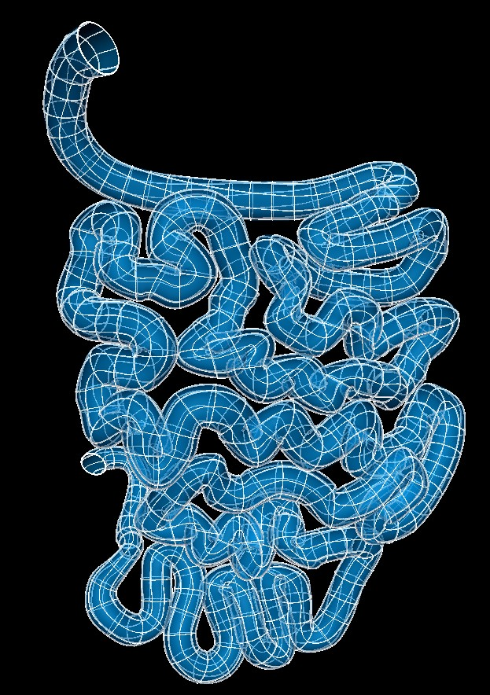

Small Intestine Scaffold
========================

The current small intestine scaffold is ``3D Small Intestine 1`` built from ``class MeshType_3d_smallintestine1``.
The human variant is shown in :numref:`fig-scaffoldmaker-human-small-intestine`.

.. _fig-scaffoldmaker-human-small-intestine:

   Human small intestine scaffold.

The small intestine scaffold is a 3-D volumetric model of the small intestine representing the duodenum, jejunum and
ileum.

Variants
--------

The small intestine scaffold is provided with parameter sets for the following three species:

* Cattle
* Human
* Mouse

These variants' geometry and annotations are best viewed in the **Scaffold Creator** tool in the ABI Mapping Tools.
On the web, the latest published generic small intestine scaffold variants can be viewed on the
`SPARC Portal <https://sparc.science/>`_ by searching for ``small intestine``, filtering for anatomical models,
selecting a variant and viewing the scaffold in its Gallery tab or via the `Organ Scaffolds
<https://docs.sparc.science/docs/organ-scaffolds>`_ help article.

The small intestine scaffold script generates the scaffold mesh and geometry from ellipsoid and cubic functions based on
a one dimensional central path which describes the path of the small intestine. The parameters were carefully tuned for
each species, and it is not recommended that these be edited.

Instructions for editing the central path are given with the ABI Mapping Tools **Scaffold Creator** documentation.
Note that the D2 derivative along the path points towards the first node around the cross-section along the small
intestine. If editing, use the Interactive Functions to *Smooth derivatives*, and *Smooth side cross derivatives* to
make these as smooth as required.

The central paths used to generate the current cattle and mouse small intestine scaffold are obtained from tracing
central paths from dissection images and average dimensions obtained from the literature. The human small intestine
scaffold is created based on a central path and data derived from the small intestine retrieved from Anatomography.

The mucosa, submucosa, circular muscle, longitudinal muscle and serosa layers of the small intestine are fully
represented on the scaffold when *Number of elements through wall* is set to ``4``. Alternatively, the entire small
intestinal wall can be represented as a single layer by setting *Number of elements through wall* to ``1``.

Coordinates
-----------

The small intestine scaffold defines the geometric, flat and material coordinates.

The geometric ``coordinates`` field gives an approximate, idealized representation of the small intestine shape for the
species, which is intended to be fitted to actual data for a specimen.

The ``flat coordinates`` represents the geometric field when the small intestine scaffold is cut along its length and
laid flat. This field is intended for fitting data obtained from a flat small intestine preparation.

The material coordinates field ``small intestine coordinates`` defines a highly idealized coordinate system to give
permanent locations for embedding structures in the small intestine. It is a cylindrical tube and can be viewed by
visualising this field in the *Display* tab of **Scaffold Creator**.

The small intestine scaffold supports limited refinement/resampling by checking *Refine* (set parameter to ``true``)
with chosen *Refine number of elements* parameters. Be aware that only the ``coordinates`` field is currently defined on
the refined mesh (but annotations are transferred).

Annotations
-----------

Important anatomical regions of the small intestine are defined by groups of elements (or faces, edges and nodes/points)
and annotated with standard term names and identifiers from a controlled vocabulary.

Annotated 3-dimensional volume regions are defined by groups of 3-D elements including:

* circular muscle layer of small intestine
* duodenum
* ileum
* jejunum
* longitudinal muscle layer of small intestine
* mucosa of small intestine
* small intestine
* submucosa of small intestine

**Terms for volume regions such as the above are not to be used for digitized contours!** They are used for applying
different material properties in models and the strain/curvature penalty (stiffness) parameters in fitting.

Annotated 2-dimensional surface regions are defined for matching annotated contours digitized from medical images
including (where ``surface`` is the outside boundary on the meshes):

* luminal surface of duodenum
* serosa of duodenum
* serosa of small intestine

Annotated 1-dimensional line regions are defined for matching annotated contours digitized from medical images including
(using only one of the items separated by slash /):

* circular-longitudinal muscle interface of the first segment of the duodenum along the gastric-omentum attachment
