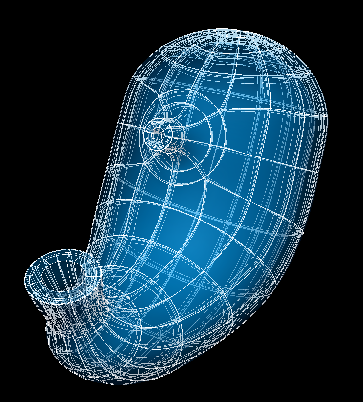

Stomach Scaffold
================

The current stomach scaffold is ``3D Stomach 1`` built from ``class MeshType_3d_stomach1``.
The human variant is shown in :numref:`fig-scaffoldmaker-human-stomach`.

.. _fig-scaffoldmaker-human-stomach:

   Human stomach scaffold.

The stomach scaffold is a 3-D volumetric model of the stomach representing the fundus, corpus, cardia, antrum, pylorus,
and a short distal section of the esophagus as well as a short proximal section of the duodenum.

Variants
--------

The stomach scaffold is provided with parameter sets for the following four species, which differ in shape:

* Human
* Mouse
* Pig
* Rat

These variants' geometry and annotations are best viewed in the **Scaffold Creator** tool in the ABI Mapping Tools.
On the web, the latest published generic stomach scaffold variants can be viewed on the
`SPARC Portal <https://sparc.science/>`_ by searching for ``stomach``, filtering for anatomical models, selecting a
variant and viewing the scaffold in its Gallery tab or via the `Organ Scaffolds
<https://docs.sparc.science/docs/organ-scaffolds>`_ help article.

The stomach scaffold script generates the scaffold mesh and geometry from an idealization of their shapes. The mesh is
derived from ellipsoid and cubic functions based on a one dimensional central path with side axes controlling lateral
dimensions. The parameters were carefully tuned for each species, and it is not recommended that these be edited.

Instructions for editing the central path are given with the ABI Mapping Tools **Scaffold Creator** documentation.
Note that the D2 and D3 derivatives control the side dimensions, and derivatives D12 and D13 control the rate of change
of these along the central path. If editing, use the Interactive Functions to *Smooth derivatives*,
*Make side derivatives normal* and *Smooth side cross derivatives* to make these as smooth as required.

The rat stomach scaffold is parameterized with average data from segmentation of Micro-CT image data of 11 animals
performed at the Powley laboratory using Neurolucida (MBF Bioscience), while the human, mouse, and pig stomach scaffolds
are parameterized with literature data to represent the anatomy as accurate as possible.

The mucosa, submucosa, circular muscle, longitudinal muscle and serosa layers of the stomach are fully represented on
the scaffold when *Number of elements through wall* is set to ``4``. Alternatively, the entire stomach wall can be
represented as a single layer by setting *Number of elements through wall* to ``1``.

[A special ``Material`` parameter set is provided to allow new species' parameters to be developed from the material
coordinates definition (see below).]

Coordinates
-----------

The stomach scaffold defines the geometric, split and material coordinates.

The geometric ``coordinates`` field gives an approximate, idealized representation of the stomach shape for the species,
which is intended to be fitted to actual data for a specimen.

The ``split coordinates`` follows the geometric field but provides disconnected and duplicated derivatives for nodes on
the margin between the dorsal and ventral stomach (the boundary where stomach specimens are usually dissected into
halves for imaging purposes). This field is intended for fitting data obtained from the dorsal or ventral stomach.

The material coordinates field ``stomach coordinates`` defines a highly idealized coordinate system to give permanent
locations for embedding structures in the stomach. It is defined by a capsule-shaped structure with an inlet cylindrical
tube representing the esophagus and another outlet tube representing the duodenum. This can be viewed by
visualising this field in the *Display* tab of **Scaffold Creator** or by switching to the special ``Material``
parameter set.

The stomach scaffold supports limited refinement/resampling by checking *Refine* (set parameter to ``true``) with chosen
*Refine number of elements* parameters. Be aware that only the ``coordinates`` field is currently defined on the refined
mesh (but annotations are transferred).

Annotations
-----------

Important anatomical regions of the stomach are defined by groups of elements (or faces, edges and nodes/points) and
annotated with standard term names and identifiers from a controlled vocabulary.

Annotated 3-dimensional volume regions are defined by groups of 3-D elements including (using only one of the items
separated by slash /):

* body of stomach
* cardia of stomach
* circular/longitudinal muscle layer of stomach
* dorsal stomach
* duodenum
* esophagogastric junction
* esophagus
* esophagus mucosa
* esophagus smooth muscle circular/longitudinal layer
* fundus of stomach
* mucosa of stomach
* pyloric antrum
* pyloric canal
* stomach
* submucosa of esophagus
* submucosa of stomach
* ventral stomach

**Terms for volume regions such as the above are not to be used for digitized contours!** They are used for applying
different material properties in models and the strain/curvature penalty (stiffness) parameters in fitting.

Annotated 2-dimensional surface regions are defined for matching annotated contours digitized from medical images
including (where ``surface`` is the outside boundary on the meshes and using only one of the items separated by slash
/):

* circular-longitudinal muscle interface of dorsal stomach/stomach/ventral stomach
* forestomach-glandular stomach junction (for mouse, rat or if *Limiting ridge* is checked)
* gastroduodenal junction
* greater/lesser curvature of stomach
* luminal surface of body of stomach
* luminal surface of cardia of stomach
* luminal surface of duodenum
* luminal surface of esophagus
* luminal surface of fundus of stomach
* luminal surface of pyloric antrum
* luminal surface of pyloric canal
* luminal surface of stomach
* serosa of body of stomach
* serosa of cardia of stomach
* serosa of duodenum
* serosa of esophagus
* serosa of fundus of stomach
* serosa of pyloric antrum
* serosa of pyloric canal
* serosa of stomach

Annotated 1-dimensional line regions are defined for matching annotated contours digitized from medical images including
(using only one of the items separated by slash /):

* circular-longitudinal muscle interface of body of stomach along the gastric-omentum attachment
* circular-longitudinal muscle interface of esophagus along the cut margin
* circular-longitudinal muscle interface of the first segment of the duodenum along the gastric-omentum attachment
* circular-longitudinal muscle interface of fundus of stomach along the greater curvature
* circular-longitudinal muscle interface of gastroduodenal junction
* circular-longitudinal muscle interface of pyloric antrum along the greater/lesser curvature
* circular-longitudinal muscle interface of pyloric canal along the greater/lesser curvature
* limiting ridge on circular-longitudinal muscle interface/luminal surface/serosa (only in mouse, rat or if *Limiting ridge* is checked)

Several fiducial marker points are defined on the stomach scaffold, of which the followings are potentially usable when
digitizing:

* body-antrum junction along the greater curvature on circular-longitudinal muscle interface/luminal surface/serosa
* distal point of lower esophageal sphincter serosa on the greater/lesser curvature of stomach
* esophagogastric junction along the greater curvature on circular-longitudinal muscle interface/luminal surface/serosa
* esophagogastric junction along the lesser curvature on circular-longitudinal muscle interface/luminal surface/serosa
* fundus-body junction along the greater curvature on circular-longitudinal muscle interface/luminal surface/serosa (only in human, pig or if *Limiting ridge* is unchecked)
* gastroduodenal junction along the greater curvature on circular-longitudinal muscle interface/luminal surface/serosa
* gastroduodenal junction along the lesser curvature on circular-longitudinal muscle interface/luminal surface/serosa
* limiting ridge at the greater curvature on serosa/the circular-longitudinal muscle interface/luminal surface (only in mouse, rat or if *Limiting ridge* is checked)
