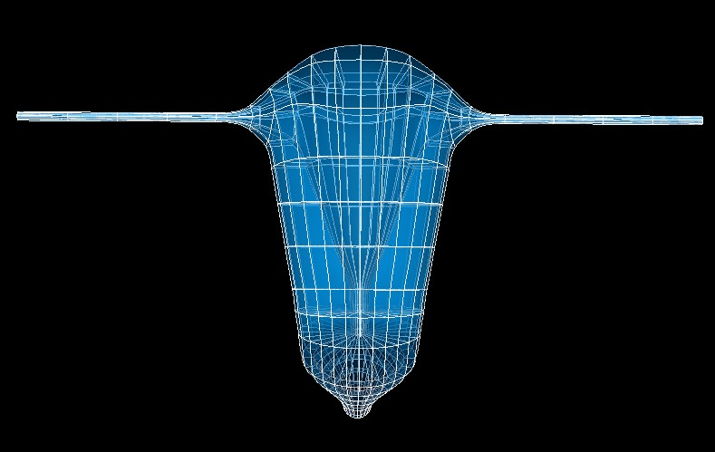

Uterus Scaffold
================

The current uterus scaffold is ``3D Uterus 1`` built from ``class MeshType_3d_uterus1``.
The human variant is shown in :numref:`fig-scaffoldmaker-human-uterus`.

.. _fig-scaffoldmaker-human-uterus:

   Human uterus scaffold.

The uterus scaffold is a 3-D volumetric model of the uterus representing the oviducts, fundus, body, cervix, and vagina.

Variants
--------

The uterus scaffold is provided with parameter sets for the following three species, which differ in shape:

* Human
* Mouse
* Rat

These variants' geometry and annotations are best viewed in the **Scaffold Creator** tool in the ABI Mapping Tools.

The uterus scaffold script generates the scaffold mesh and geometry from an idealization of their shapes. The mesh is
derived from a one dimensional network layout with side axes controlling its lateral dimensions. The parameters were
carefully tuned for each species, and it is not recommended that these be edited.

Instructions for editing the network layout are given with the ABI Mapping Tools **Scaffold Creator** documentation.
Note that the D2 and D3 derivatives control the side dimensions, and derivatives D12 and D13 control the rate of change
of these along the network layout. If editing, use the Interactive Functions to *Smooth derivatives*,
*Make side derivatives normal* and *Smooth side cross derivatives* to make these as smooth as required.

The human, mouse, and rat uterus scaffolds are parameterized with literature data to represent the anatomy accurately.

Coordinates
-----------

The uterus scaffold defines the geometric coordinates.

The geometric ``coordinates`` field gives an approximate, idealized representation of the uterus shape for the species,
which is intended to be fitted to actual data for a specimen.

The uterus scaffold supports limited refinement/resampling by checking *Refine* (set parameter to ``true``) with chosen
*Refine number of elements* parameters. Be aware that only the ``coordinates`` field is currently defined on the refined
mesh (but annotations are transferred).

Annotations
-----------

Important anatomical regions of the uterus are defined by groups of elements (or faces, edges and nodes/points) and
annotated with standard term names and identifiers from a controlled vocabulary.

Annotated 3-dimensional volume regions are defined by groups of 3-D elements including:

* body of uterus
* dorsal uterus
* fundus of uterus
* left oviduct (or left uterine horn for mouse and rat)
* left uterus
* myometrium
* right oviduct (or left uterine horn for mouse and rat)
* right uterus
* uterus
* vagina
* ventral uterus

**Terms for volume regions such as the above are not to be used for digitized contours!** They are used for applying
different material properties in models and the strain/curvature penalty (stiffness) parameters in fitting.

Annotated 2-dimensional surface regions are defined for matching annotated contours digitized from medical images
including:

* lumen of body of uterus
* lumen of fundus of uterus
* lumen of left oviduct (lumen of left uterine horn for mouse and rat)
* lumen of right oviduct (lumen of right uterine horn for mouse and rat)
* lumen of uterus, cervix and vagina
* serosa of body of uterus
* serosa of fundus of uterus
* serosa of left oviduct
* serosa of right oviduct
* serosa of uterus
* serosa of uterus, cervix and vagina
* serosa of vagina
* uterine cavity
* uterine cervix
* vaginal canal

For the human uterus scaffold, annotated 1-dimensional line regions are defined for matching annotated contours
digitized from medical images including:

* external cervical os
* internal cervical os
* left broad ligament of uterus
* left transverse cervical ligament
* pubocervical ligament
* right broad ligament of uterus
* right transverse cervical ligament
* vagina orifice

Several fiducial marker points are defined on the human uterus scaffold, of which the followings are potentially usable
when digitizing:

* junction of left round ligament with uterus
* junction of left uterosacral ligament with uterus
* junction of right round ligament with uterus
* junction of right uterosacral ligament with uterus
