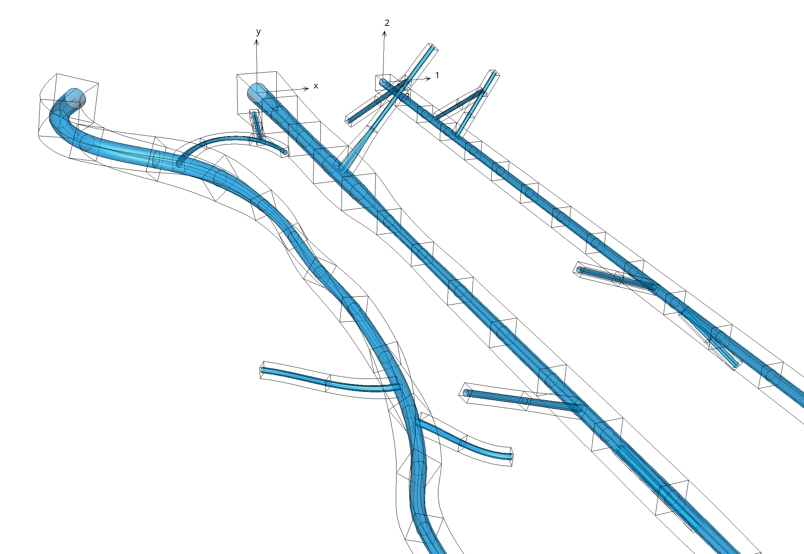
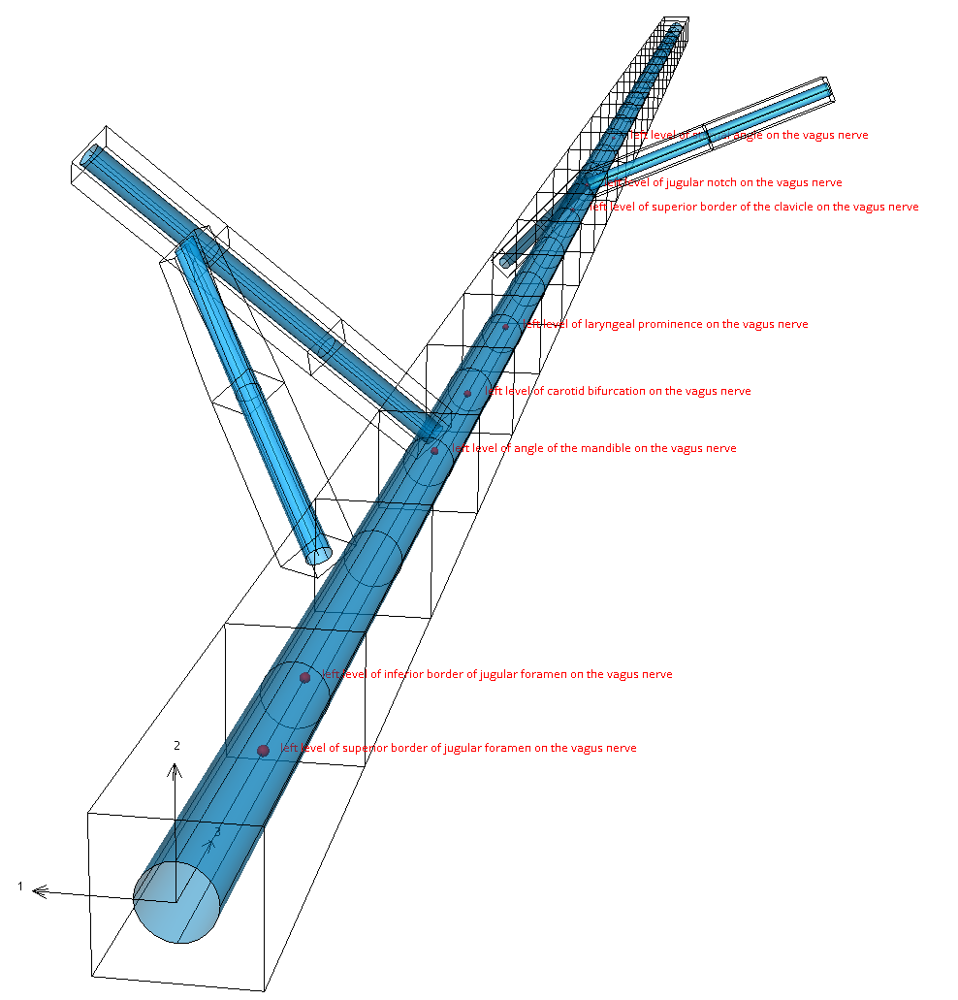

Vagus Scaffold
================

The current subject-specific vagus scaffold is ``3D Nerve 1`` built from ``class MeshType_3d_nerve1``.
Each subject-specific vagus scaffold is built from an input file containing segmentations of the trunk, branches,
level markers, radius and orientation points for that subject.

A mockup vagus scaffold with its 3 coordinates is shown in :numref:`fig-scaffoldmaker-vagus-3-coordinates`.

.. _fig-scaffoldmaker-vagus-3-coordinates:

   Vagus nerve scaffold mockup with (from L-R): geometric coordinates, straight coordinates and material/vagus coordinates.

Translucent surfaces in the above figure show the round equivalent-area epineurium surface, but the bounds of the scaffold is a box of twice these dimensions to enclose the true cross-section shape and nearby tissue.
The boxes along the vagus trunk and branches are 3-D hexahedral finite elements with local coordinate systems spanning from 0.0 to 1.0 along three directions down the vagus, left and up.
These are entirely defined as functions of coordinate position and direction parameters along the centroid of the trunk and branches, and 2-D epineurium surfaces and 1-D centroid lines are defined from the same parameters.
The start of each branch is defined by general linear mapping of parent/trunk parameters making them fully embedded ('built-in') to their host at that point, preserving their relative directions when the scaffold is fitted to other configurations such as in-body trace data.

Input file requirements
-----------------------

The input file should have annotated segmentations for the vagus trunk and the vagal branches.
The following annotations could be used for vagus trunk:

* left/right vagus nerve
* left/right cervical trunk
* left/right thoracic trunk
* left/right cervical vagus nerve
* left/right thoracic vagus nerve
* left/right vagus X nerve trunk

All vagal branches should be annotated with 'branch' or 'nerve' keyword. Each branch should have a distinct name,
including accepted variant names containing letters A, B, C, etc., so there should not be multiple branches with
the same name.

The input file should also have included some of the anatomical landmarks to be able to locate the vagus in the body
and to estimate vagus nerve real length. The current minimum is two included landmarks as marker datapoints.
The list of approved landmarks is as follows (and visualized in :numref:`fig-scaffoldmaker-vagus-material-markers`):

* left/right level of superior border of jugular foramen on the vagus nerve
* left/right level of inferior border of jugular foramen on the vagus nerve
* left/right level of angle of the mandible on the vagus nerve
* left/right level of carotid bifurcation on the vagus nerve
* left/right level of laryngeal prominence on the vagus nerve
* left/right level of superior border of the clavicle on the vagus nerve
* left/right level of jugular notch on the vagus nerve
* left/right level of sternal angle on the vagus nerve

.. _fig-scaffoldmaker-vagus-material-markers:

   Vagus nerve level markers shown in material ``vagus coordinates``.

Orientation points could be included in the input file for better nerve fitting. If included, they should be listed as
``nodes``, not ``datapoints``. The following annotation group names must be used for orientation nodes:

* orientation left
* orientation anterior
* orientation left anterior
* orientation right anterior
* orientation right
* orientation right posterior
* orientation posterior
* orientation left posterior

Variants
--------

The vagus scaffold is provided with the following parameter sets:

* Human left vagus
* Human right vagus

Coordinates
-----------

The vagus box scaffold defines geometric, straight and material coordinates as shown in :numref:`fig-scaffoldmaker-vagus-3-coordinates`

The ``geometric coordinates`` field is fitted to the coordinates supplied in the input file.

The ``straight coordinates`` field defines a coordinate system with a straight line as vagus trunk, with origin as
the top of the trunk and conserving trunk length from geometric coordinates. The branches have the same dimensions and
relative directions to their origin on a parent branch or trunk, but are straight.

The ``material coordinates`` field defines a coordinate system to give permanent locations for landmarks on the vagus.
It is defined as a straight line as vagus trunk, with origin as the top of the vagus trunk and 1 as the bottom end
of the vagus trunk. The branches are defined as lines with the same orientation as when they are leaving the trunk.

Annotations
-----------

Important anatomical features of the vagus nerve are defined by groups of elements (or faces, edges and nodes/points) and
annotated with standard term names and identifiers from a controlled vocabulary.

Each subject-specific vagus box scaffold has the following defined groups of 3-D elements:

* ``vagus centroid`` - centroid of nerve/branch, useful for later fitting centroid data in another geometric configuration such as in-body/MRI tracings.
* ``epineurium`` - approximately round representation of surface of epineurium on nerve/branch, useful for later fitting to precise contours of the epineurium boundary.
* ``orientation anterior`` - line on anterior edge of epineurium of the nerve trunk only, useful for later fitting 'orientation anterior' points in another geometric configuration.
